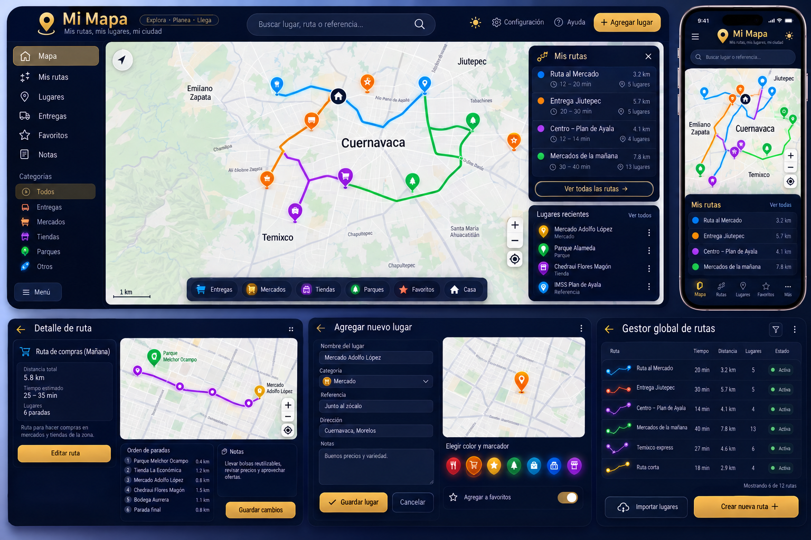

# 📌 Sobre el proyecto

**Mi Mapa** es un proyecto personal creado para aprender y practicar
desarrollo web mientras se construye una website útil para organizar
rutas y lugares.

La idea es tener en un solo lugar los sitios importantes, las rutas
habituales y los puntos relacionados con entregas, compras y actividades
del día a día.

El proyecto está pensado para funcionar tanto en **computadora como en
dispositivos móviles**, con una interfaz oscura, moderna y enfocada en
mapas.

## 🎨 Diseño

La interfaz utiliza una identidad visual basada principalmente en:

-   🌑 Azul marino oscuro
-   🟡 Dorado
-   🔵🔴🟢🟣 Colores diferentes para identificar rutas y categorías
-   📍 Marcadores para los lugares
-   🗺️ Mapas como elemento principal de navegación

### Vista conceptual

La siguiente imagen representa la dirección visual que se busca para el
proyecto:

## ✨ Funcionalidades planeadas

### 🗺️ Mapa

-   Visualizar lugares y rutas.
-   Mostrar diferentes marcadores.
-   Identificar las rutas mediante colores.
-   Consultar información de los lugares.

### 🛣️ Mis rutas

-   Crear rutas personalizadas.
-   Guardar diferentes puntos de una ruta.
-   Consultar distancia y tiempo estimado.
-   Organizar las paradas.
-   Agregar notas y referencias.

### 📍 Lugares

-   Registrar nuevos lugares.
-   Guardar nombre, categoría, dirección y referencias.
-   Añadir notas.
-   Marcar lugares como favoritos.

### 🚚 Entregas

-   Organizar lugares relacionados con entregas.
-   Crear rutas para varias entregas.
-   Facilitar la planificación de recorridos.

### ⭐ Favoritos

-   Guardar lugares importantes.
-   Acceder rápidamente a ellos.

### 📝 Notas

-   Guardar información adicional relacionada con lugares o rutas.

## 📱 Diseño adaptable

Uno de los objetivos del proyecto es crear una interfaz **responsive**,
para que pueda utilizarse cómodamente desde:

-   💻 Computadora
-   📱 Teléfono
-   💻 Pantallas de diferentes tamaños

La estructura puede cambiar conforme el proyecto vaya creciendo.

## 🎯 Objetivo

El objetivo principal de este proyecto es crear una website propia
mientras se practica y fortalece el aprendizaje de:

-   Desarrollo web
-   Diseño de interfaces
-   Diseño responsive
-   Manejo de datos
-   Organización de proyectos
-   Git y GitHub

Más adelante se podrán incorporar nuevas funcionalidades conforme avance
el desarrollo.