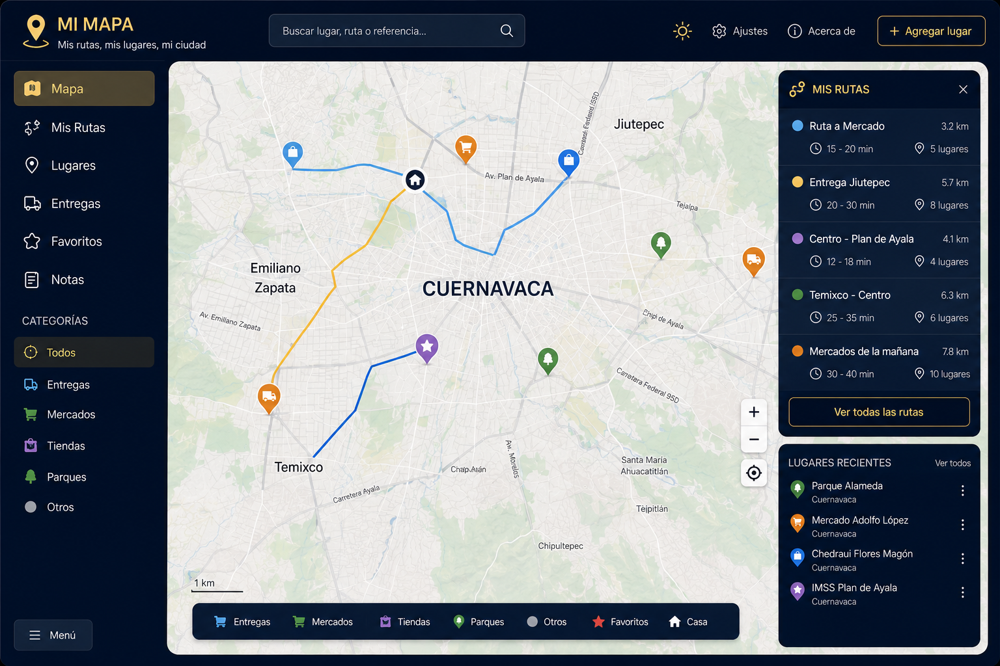

# 🧭 Mi Mapa

**Mi Mapa** es una plataforma web de desarrollo personal diseñada para centralizar, analizar y dominar la infraestructura vial de mi ciudad y sus municipios colindantes. El proyecto surge de la curiosidad técnica de construir herramientas propias y de la necesidad de explorar el entorno urbano de forma estratégica, consolidando rutas tradicionales y alternativas viales en un solo lugar seguro.

Este espacio funciona como un laboratorio de uso estrictamente privado. Está diseñado completamente a mi medida para transformar datos geográficos en una guía visual intuitiva, permitiéndome consolidar mi propio conocimiento del territorio y navegar con total autonomía en mis actividades diarias.

## 🎯 Objetivos Clave

* **Optimización de Navegación:** Facilitar el desplazamiento eficiente a través de zonas desconocidas.

* **Guía Visual de Transporte:** Cartografiar redes de transporte público y privado para trazar conexiones precisas entre puntos clave.

* **Centralización Geográfica:** Crear una base de datos propia para reducir la dependencia de terceros y dominar el territorio local.

## 🎨 Diseño de la Interfaz (Mockup)

A continuación, muestro el diseño visual que planifiqué y estructuré para el panel de control:

